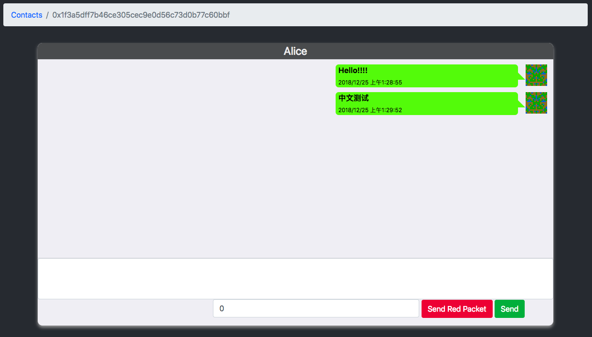
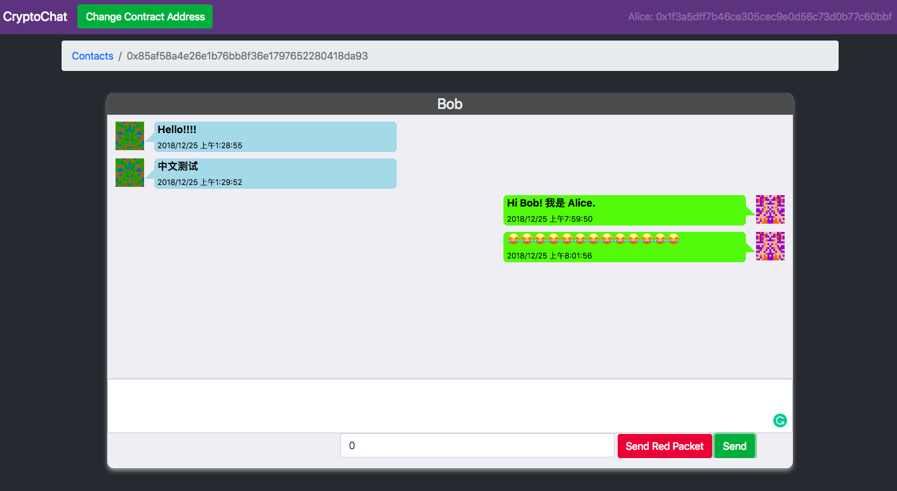
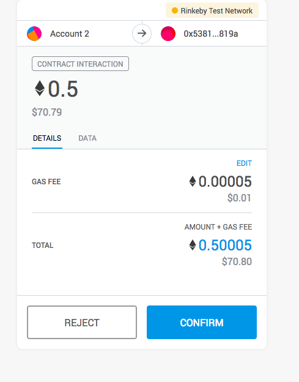

# CryptoChat-web

本仓库为 CryptoChat 项目的 web 前端部分，使用 TypeScript 作为主要语言编写，框架为 Vue，使用 Webpack 构建。

[合约仓库](https://github.com/miguch/cryptochat)

[CryptoChat (支持 Ropsten/Rinkeby 测试网络)](https://cryptochat.miguch.com)

## CryptoChat 简介

CryptoChat 是一个利用以太坊平台实现的去中心化应用，目的是实现去中心化的安全简讯通信，避免在通信过程中发生的聊天数据泄露，数据被监听、篡改等情况。通过前端的配合将加密后的聊天数据发送至区块链上，利用 RSA 等非对称加密算法使得只有知道私钥的用户才可对聊天信息进行解密，实现安全的简讯通信。

## 构建

**构建项目，生成静态文件至 dist 目录**

```
npm run build
```

**使用 webpack-dev-server搭建用于开发的服务器，监听在8082端口**

```
npm run serve
```


## Web 前端实现简介

前端主要分为3个页面：

1. 欢迎页：每次启动 CryptoChat-web 均会跳转至该页，根据用户地址查询智能合约上是否已存在用户，若无，则显示注册页面：

   

   若有，则显示登录页面：

   

   进行注册时若出现错误，则显示错误信息：

   

   每次登录和注册操作都涉及到 RSA 密钥的计算，每次操作在 Chrome 浏览器上时间一般为10秒以内，Firefox浏览器 上约为30秒至一分钟。

2. 联系人页面：

   登录或注册后进入联系人页面，该页面显示所有曾经进行过聊天的用户列表，对于新注册用户，该表为空：

   

   可通过上方搜索栏查找用户名或地址搜寻所有已注册用户(清空搜索栏后搜索即可返回联系人目录)：

   

3. 聊天页面：

   在联系人页面中点击联系人即可进入聊天页面：

   

   发送消息效果如下：

   

   接收消息效果如下：

   

   点击红包后会发起一笔对合约地址指定数值的转账，智能合约将会将红包数值直接转入目标地址：

   

## 数据加解密

CryptoChat 通过在前端对数据的正确加密与解密来保障发送消息的安全，主要使用的算法为RSA 与 AES。

CryptoChat 前端进行数据的加解密与签名、验证使用了 Go 语言的crypto库，使用 gopherjs 编译为 js 文件并在 Webpack 打包时复制到生成目录下，运行时在全局注册一个 RsaCrypt 变量，提供进行数据加解密和数字签名生成与验证的方法。

### 密钥生成

CryptoChat 智能合约上对每个已注册用户存储了其RSA 公钥，考虑到让用户自行保存其私钥不是较为方便地方法，这里选择加入了一个密码机制，用户在每次进入页面时需要输入其密码。

通过密码生成RSA 密钥对的方法参考了[cryptico](https://github.com/wwwtyro/cryptico)库的做法，其中将输入的passphrase进行一次 SHA256哈希后作为生成密钥的随机种子。而在 CryptoChat 的 Go 语言部分中，则是将用户的地址与密码进行拼接并加盐后应用于 PBKDF2伪随机函数用于生成1024位 RSA 密钥对。相较于SHA-256，PBKDF2的设计有着更高的计算代价，使得密码暴力破解的时间代价更高。

在实现过程中，发现了使用如上方法时对每个地址-密码对生成的密钥都有两种，查找相关资料发现在[Go 1.11](https://golang.org/doc/go1.11#crypto)后在生成 RSA 密钥的过程中会首先以二分之一的概率从随机数据流中读取一个字节，使得对同一个随机流生成的密钥可能有两种。这样的目的是令测试不依赖于内部实现，但是在本项目下并不是期望的行为，因此在这里修改了生成密钥对的函数，去除了对首个字节的随机读取。

当前生成密钥的方法仍存在的缺点有：每次登录和注册都涉及到密钥的生成操作，这个过程可能耗时较长，且会造成浏览器的阻塞，在 Chrome 中的生成时间一般在10秒以内，尚且可以接受，但在 Firefox 和 iOS 上的 Cipher 应用中都要大约30秒至1分钟才能完成生成，对使用体验影响较大。

### 发送消息数据加解密

RSA算法的机制决定了在没有私钥的情况下对密文进行破解的代价非常高，但 RSA 加密的效率较低，而且每次加密的明文数据长度不能超过密钥长度减11个字节，不适用于对于本应用的消息解密场景，因此对消息的加解密选择了使用对称加密的 AES 算法进行，使用的密钥长度为256位。

每次加密数据时随机生成32字节的密钥，对消息使用PKCS #7进行填充后使用 AES 在 CBC 模式下加密后将 AES 密钥使用 RSA 进行加密后将 AES 密码密文放置在密文数据头部，每次解密时则先从密文数据前128字节解密出 AES 密钥，并使用该密钥解密剩下的密文数据，进行 Unpadding 后获得明文数据。

### 数字签名

应用中对用户信息中的公钥数据以及发送消息时包括消息双方、消息内容以及发送日期的消息数据会使用 RSA 进行数字签名以证明数据的有效性，当用户登录时会验证用户信息的正确性，若不正确则无法登录，对于从区块链获取的消息数据，若数据签名无效则直接忽略该消息。

## 项目中使用的开源项目

- [ethereum/**blockies**](https://github.com/ethereum/blockies): 根据地址生成用户头像。
- [ethjs/**ethjs**](https://github.com/ethjs/ethjs): 使得程序可以用 Promise 的方法异步地与区块链进行交互，而不需要通过 Metamask 的回调函数的方法。
- [golang/crypto](https://github.com/golang/go/tree/master/src/crypto)：使用 Go 进行 RSA 和 AES 的数据加解密以及数字签名。
- [gopherjs/**gopherjs**](https://github.com/gopherjs/gopherjs): 将 Go 编译为 JavaScript 供程序使用。
- [vuejs/vue](https://github.com/vuejs/vue) 前端页面使用的框架。