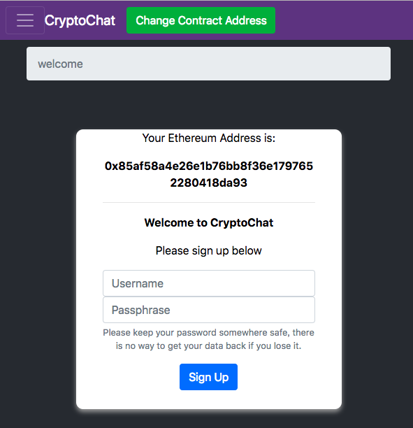
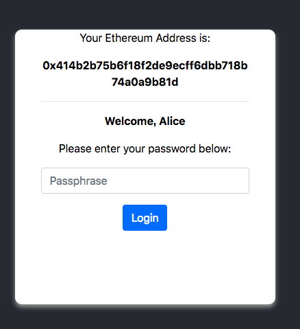
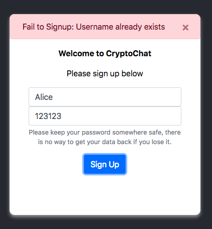
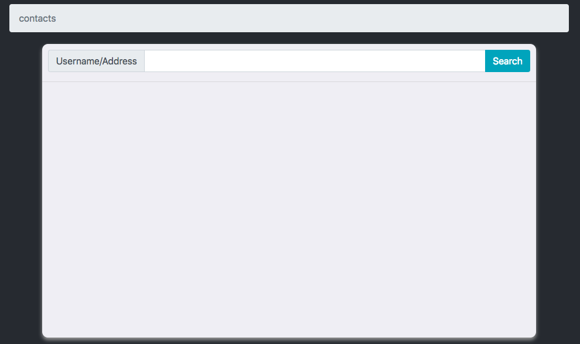
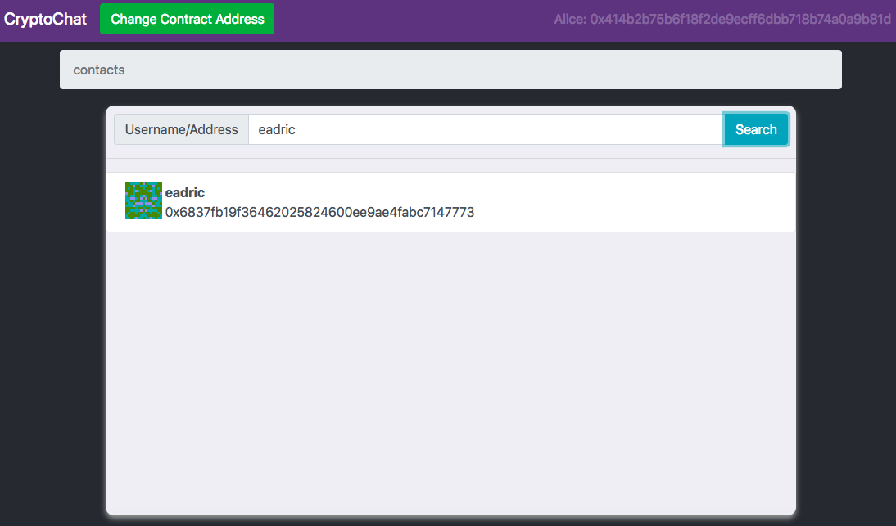
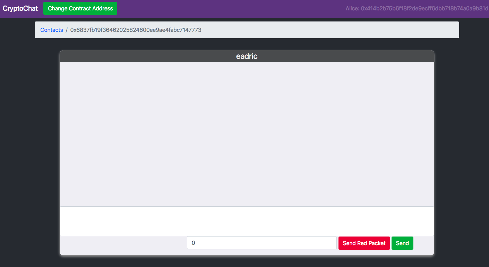
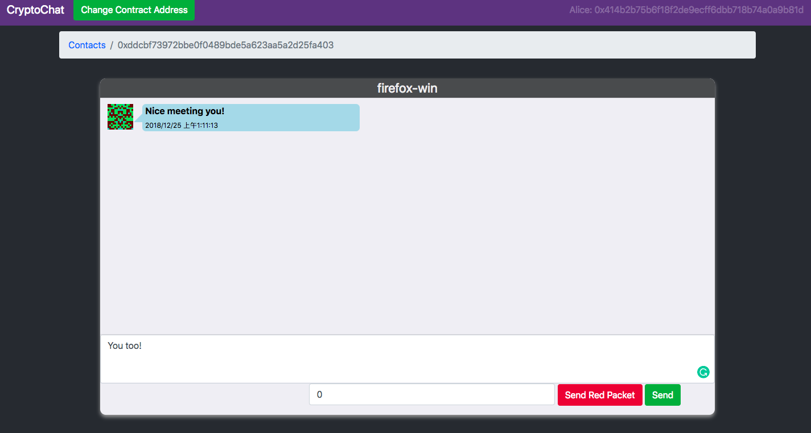

# CryptoChat-web

本仓库为 CryptoChat 项目的 web 前端部分，使用 TypeScript 作为主要语言编写，框架为 Vue，使用 Webpack 构建。

[合约仓库](https://github.com/miguch/cryptochat)

[CryptoChat (支持 Ropsten/Rinkeby 测试网络)](https://cryptochat.miguch.com)

## CryptoChat 简介

CryptoChat 是一个利用以太坊平台实现的去中心化应用，目的是实现去中心化的安全简讯通信，避免在通信过程中发生的聊天数据泄露，数据被监听、篡改等情况。通过前端的配合将加密后的聊天数据发送至区块链上，利用 RSA 等非对称加密算法使得只有知道私钥的用户才可对聊天信息进行解密，实现安全的简讯通信。

## 构建

**构建项目，生成静态文件至 dist 目录**

```
npm run build
```

**使用 webpack-dev-server搭建用于开发的服务器，监听在8082端口**

```
npm run serve
```


## Web 前端实现简介

前端主要分为3个页面：

1. 欢迎页：每次启动 CryptoChat-web 均会跳转至该页，根据用户地址查询智能合约上是否已存在用户，若无，则显示注册页面：

   

   若有，则显示登录页面：

   

   进行注册时若出现错误，则显示错误信息：

   

   每次登录和注册操作都涉及到 RSA 密钥的计算，每次操作在 Chrome 浏览器上时间一般为10秒以内，Firefox浏览器 上约为30秒至一分钟。

2. 联系人页面：

   登录或注册后进入联系人页面，该页面显示所有曾经进行过聊天的用户列表，对于新注册用户，该表为空：

   

   可通过上方搜索栏查找用户名或地址搜寻所有已注册用户(清空搜索栏后搜索即可返回联系人目录)：

   

3. 聊天页面：

   在联系人页面中点击联系人即可进入聊天页面：

   

   页面支持发送红包及消息，接收消息后效果如下：

   
